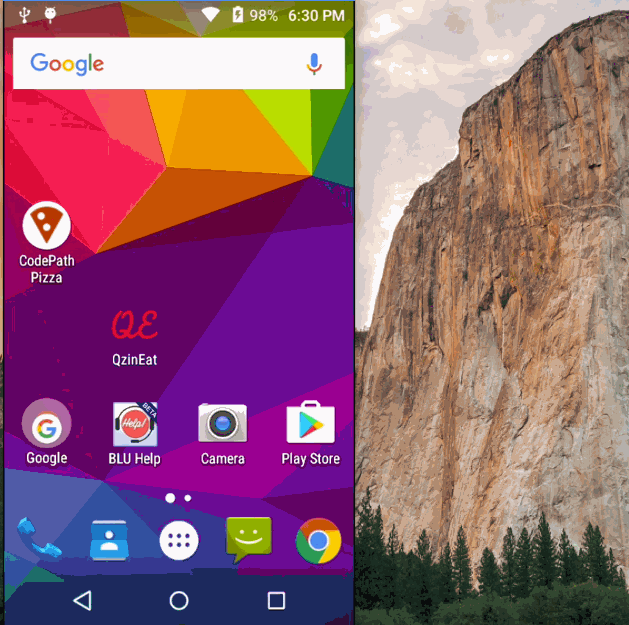

# Android Simple Fragments Firebase application - Fragments Sample App

Working sample code for simple app demonstrating fragments in Android. Key topics covered:

* Static Fragment
* Dynamic Fragment
* Communicating with Fragments
* Fragments in different Layout

## Video Walkthrough

